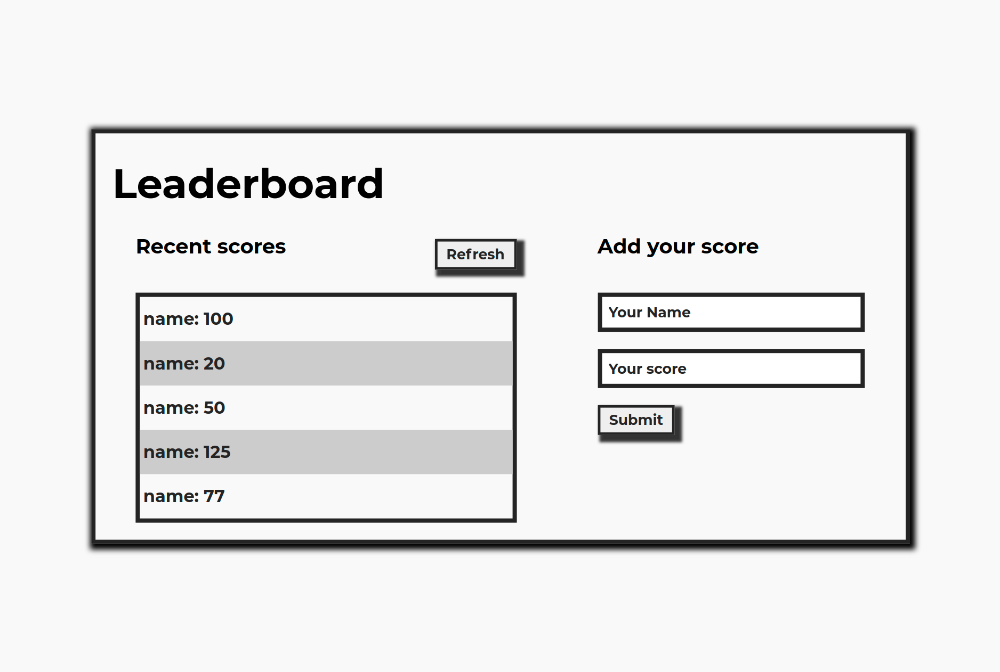

# Leaderboard

* The leaderboard website displays scores submitted by different players. It also allows you to submit your score. All data is preserved thanks to the external Leaderboard API service.

Below you can see how this website should look and behave:



## Why this Leaderboard page is special?

### Learning objectives

- Use callbacks and promises.
- Learn how to use proper ES6 syntax.
- Use ES6 modules to write modular JavaScript.
- Use webpack to bundle JavaScript .
- Send and receive data from an API.
- Use API documentation.
- Understand and use JSON.
- Make JavaScript code asynchronous.🐛🐛.
  
## Live Demo

[Demo](https://thirsty-montalcini-8d768c.netlify.app)


## Setup

### Clone this repository

```bash
$ git clone https://github.com/BenMukebo/Leaderboard.git
$ cd Leaderboard
```

### set up webpack

```bash

$ npm install --save-dev html-webpack-plugin  
$ npm install --save-dev webpack-dev-server
$ npm npm install --save-dev style-loader css-loader # To able to use npm run start for live reloading.
```


### Run project

```bash
$ npm install
$ npm run build
$ npm run start # this will make webpack watching for your changes in code.
```

### Open page in browser
```bash
$ open dist/index.html
```
## Test

For tracking linter errors locally you need to follow these steps:

- For tracking the linter errors in HTML file run:
  > npx hint .

- For tracking the linter errors in CSS file run:
  > npx stylelint "**/*.{css,scss}"

  - And For tracking the linter errors in JavaScript file run:
  > npx eslint .


## Built With

- HTML
- JavaScript
- SCSS
- Webpack


## 👤 Author

The author of the entire code is Ben Mukebo-

- [GitHub](https://github.com/BenMukebo)
- [Twitter](https://twitter.com/BenMukebo)
- [LinkedIn](https://www.linkedin.com/in/kasongo-mukebo-ben-591720205/)


## 🤝 Contributing

Contributions, issues, and feature requests are welcome!

Feel free to check the [issues page](https://github.com/BenMukebo/Leaderboard/issues).

## Show your support

Give a ⭐️ if you like this project!

## Acknowledgements

Thank you [Microverse](https://img.shields.io/badge/Microverse-blueviolet) for preparing this project! 👏👏👏


## 📝 License

This project is MIT licensed.